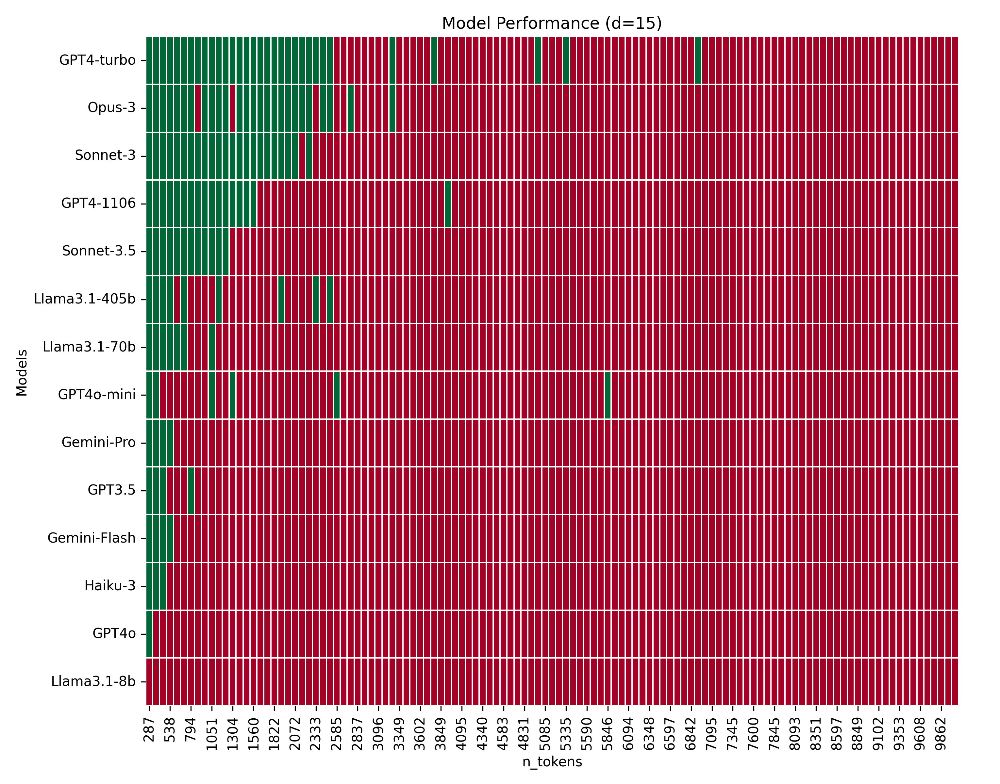
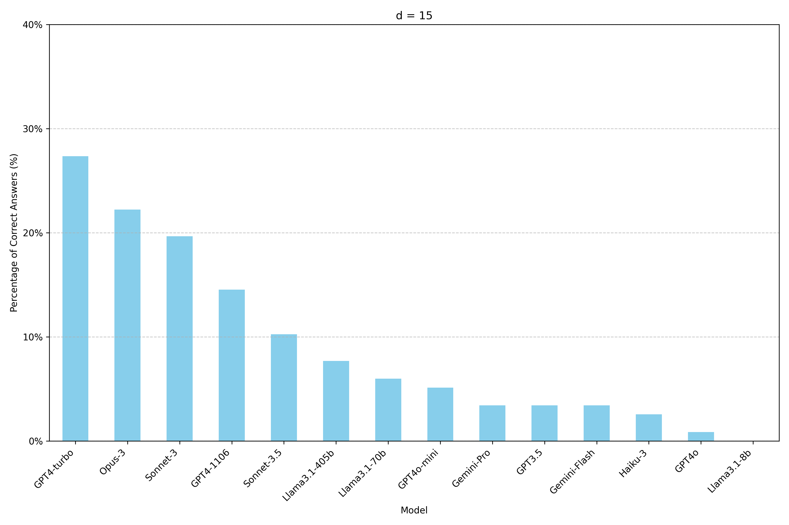
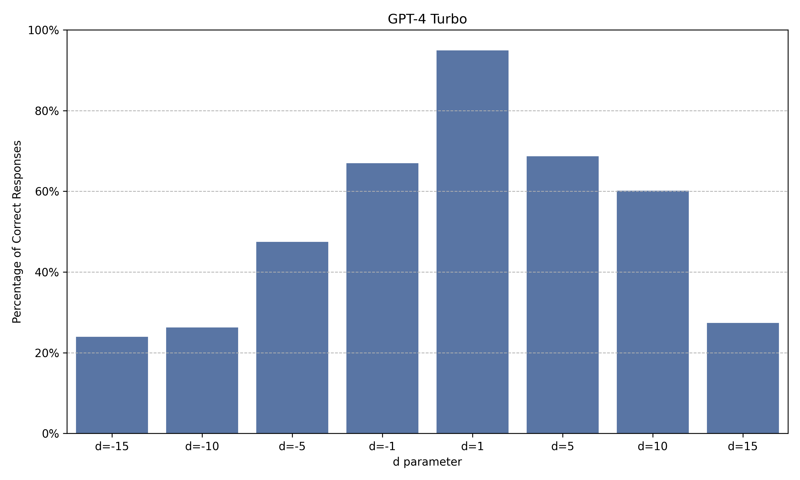
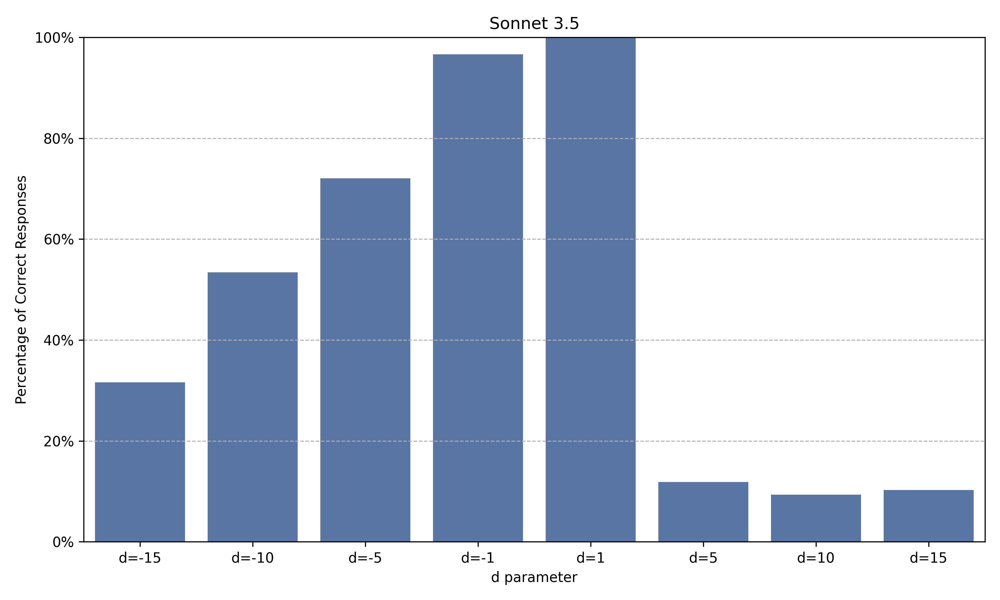
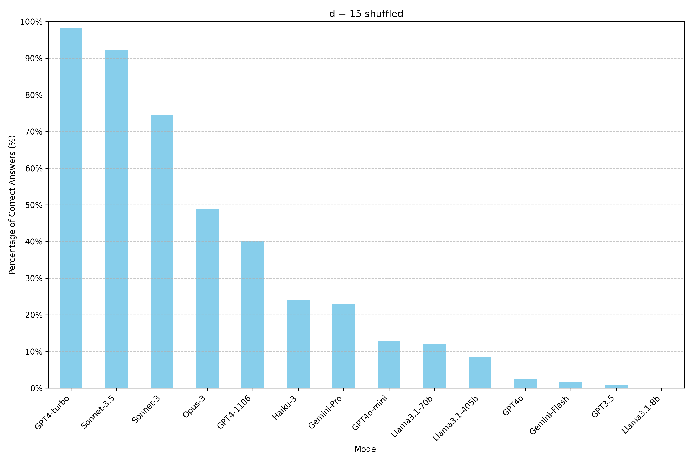

# Find The Origin - Testing LLMs on Connecting Information Across Long Context Windows 

Supported model providers: OpenAI, Anthropic

The *Find the Origin* test challenges the model to identify the origin vertex from a list of connections. For example:
```
"workbench" is connected to "dad"
"dad" is connected to "admire"

What is the origin of "admire"?
```
In this case, the origin of "admire" is "workbench". 

We can increase the size of the context window by introducing irrelevant vertices and connections. For example:
```
"spread" is connected to "transformation"
"transformation" is connected to "instrument"
"workbench" is connected to "dad"
"dad" is connected to "admire"
"brought" is connected to "enforcement"
"enforcement" is connected to "stephen"

What is the origin of "admire"?
```
The distance between the origin and destination vertices can vary depending on the parameter **d**. When the line containing the vertex 'admire' is positioned directly below the line containing the vertex 'workbench', d=1. When it is located two lines below, d=2. Example for d=2:
```
"spread" is connected to "transformation"
"workbench" is connected to "dad"
"transformation" is connected to "instrument"
"dad" is connected to "admire"

What is the origin of "admire"?
```
The parameter d can also be negative, which reverses the relative position of the vertices. Example with d=-1:
```
"transformation" is connected to "instrument"
"spread" is connected to "transformation"
"dad" is connected to "admire"
"workbench" is connected to "dad"

What is the origin of "admire"?
```
To run the test, you need to specify the value of d (*d_parameter*), the maximum number of lines (*max_lines*), and the incremental line count that distinguishes each prompt (*step_lines*). Multiple prompts will be sent to the selected LLM, with the number of tokens per prompt gradually increasing, keeping the target vertices ("workbench" <--> "admire") central.

The test results will be stored in a .csv file, containing all the outcomes (True or False), indicating whether the model correctly answered or failed each prompt, along with the token count for each prompt.

By default, the first prompt sent to the LLM will contain d + 1 lines. The number of lines in the second prompt will be d + 1 + step_lines. For the third prompt, it will be d + 1 + 2*step_lines, and so on.

## Getting Started
 
### Setup Virtual Environment

It is recommended to set up a virtual environment to manage dependencies and Python versions without affecting your global Python setup. The required Python version is 3.8 or newer.
#### Using Conda 
If you have Anaconda installed, you can create a Conda environment:
```zsh
conda create --name myenv python=3.8
```
Activate the environment: 
```zsh
conda activate myenv
```
#### Using venv
If you prefer using `venv`, which is included in the Python Standard Library:
```zsh
python3 -m venv myenv
```
On Windows, activate the environment: 
```zsh
myenv\Scripts\activate
```
On MacOS or Linux: 
```zsh
source myenv/bin/activate
```

### Environment Variables

In order to use OpenAI or Anthropic models for the test, you need to configure the environment variables:

`OPENAI_API_KEY` - API key to use if openai provider is used.
`CLAUDE_API_KEY` - API key to use if anthropic provider is used.

## Install Package

To install this package, follow these steps:

1. Clone the repository:
```zsh
git clone https://github.com/natanaelwf/LLMTest_FindTheOrigin.git
```
2. Navigate to the project directory:
```zsh
cd LLMTest_FindTheOrigin
```
3. Install the dependencies:
```zsh
pip install -r requirements.txt
```
4. Install the package:
```zsh
pip install -e .
```
## Run Test

Start using the package by calling the entry point *findtheorigin* from command line. 

You can run the analysis on OpenAI and Anthropic models with the following command line arguments:

`provider` - The provider of the model. Available options are openai and anthropic.
`model_name` - Model name of the language model accessible by the provider.
`d_parameter` - Distance (number of lines) from origin to destination vertices.
`step_lines` - Step increment for the number of lines of each prompt.
`max_lines` - Maximum number of lines the last prompt will have before finishing the test. 
`shuffle` - Optional. Randomize the positioning of irrelevant vertices. Defaults to False.

## Example of use case:
```zsh
findtheorigin --provider openai --model_name "gpt-3.5-turbo-0125" --d_parameter 5 --max_lines 600 --step_lines 8
```
In this example, the first prompt sent to the gpt-3.5-turbo-0125 model will contain 6 lines, with "admire" appearing in the 5th line below "workbench":
```
"workbench" is connected to "dad"
"review" is connected to "conclusive"
"truman" is connected to "credited"
"games" is connected to "examples"
"transformation" is connected to "instrument"
"dad" is connected to "admire"
```
The second prompt would have 14 lines (due to the 8-line increment):
```
"brilliantly" is connected to "review"
"government" is connected to "truman"
"comparable" is connected to "games"
"spread" is connected to "transformation"
"workbench" is connected to "dad"
"review" is connected to "conclusive"
"truman" is connected to "credited"
"games" is connected to "examples"
"transformation" is connected to "instrument"
"dad" is connected to "admire"
"brought" is connected to "enforcement"
"listeners" is connected to "overlooked"
"frederick" is connected to "cemetery"
"hastily" is connected to "inserted"
```
In total, by incrementing 8 lines at a time, 74 prompts would be sent to the gpt-3.5-turbo-0125 model in this example.

For reference, 8 lines corresponds to approximately 84 tokens.

## Standard Format of Prompts Sent for Testing

Each prompt follows this format:
```
Several words below are interconnected. For example:

"X" is connected to "Y"
"Y" is connected to "Z"

In this scenario, the origin of "Z" is "X". We can visualize these connections as vertices and edges, like this:
"X"-->"Y"-->"Z"

Using this logic, consider the following list of connections, where each word is simply the name of a vertex with no other semantic meaning:

"spread" is connected to "transformation"
"transformation" is connected to "instrument"
"workbench" is connected to "dad"
"dad" is connected to "admire"
"brought" is connected to "enforcement"
"enforcement" is connected to "stephen"

Your task is to find the origin of "admire". Work carefully, step by step. Your final answer must be in this format: FINAL ANSWER: YOUR_ANSWER
```
The only difference between prompts is the number of additional lines (irrelevant connections) introduced. The goal of all prompts is always to find the origin of "admire", with the answer being "workbench".

## Shuffle Parameter

By default, all irrelevant connections follow the same pattern established by the d parameter. For d=1 and a total of 6 lines, note that the irrelevant connections present the same pattern of origin and destination separated by 1 line:
```
"spread" is connected to "transformation"
"transformation" is connected to "instrument"
"workbench" is connected to "dad"
"dad" is connected to "admire"
"brought" is connected to "enforcement"
"enforcement" is connected to "stephen"
```
If the shuffle parameter is set to True, the target vertices ('workbench' <--> 'admire') will maintain the distance d, while the irrelevant connections will be shuffled:
```
"brought" is connected to "enforcement"
"transformation" is connected to "instrument"
"workbench" is connected to "dad"
"dad" is connected to "admire"
"spread" is connected to "transformation"
"enforcement" is connected to "stephen"
```
Some tests indicates that LLMs more effectively solve the Find The Origin task when the shuffle parameter is set to False.

## Maximum lines limit

All connection lines are always created from the same vertices.txt file in a deterministic manner. This file contains 4002 lines, so this is the current maximum value for testing, though it can be easily modified.

Only very common words were selected to be included in vertices.txt.

The vertices.txt file is ordered with d=1 where the target lines ("workbench" <--> "admire") are in the middle (lines 1999 and 2000).  Each run generates a new file (vertices_reorg.txt), which reorders all the lines based on the specified d parameter. It then selects the lines immediately before and after the target lines to create each prompt.

## Results

Some results obtained with temperature = 0:

<p align="center">
  
  <br>
  <em>Performance comparison of models across varying context window sizes from 287 to 10,029 tokens (16 to 944 lines), for d=15. Correct responses are marked in green and incorrect ones in red.</em>
</p>

<p align="center">
  
  <br>
  <em>Percentage performance comparison of models across varying context window sizes from 287 to 10,029 tokens (16 to 944 lines), for d=15.</em>
</p>

<p align="center">
  
  <br>
  <em>Percentage of correct answers for GPT4-Turbo for different values of d across varying context window sizes from 166 to 10,059 tokens.</em>
</p>

<p align="center">
  
  <br>
  <em>Percentage of correct answers for Sonnet 3.5 for different values of d across varying context window sizes from 166 to 10,059 tokens.</em>
</p>

<p align="center">
  
  <br>
  <em>Percentage performance comparison of models across varying context window sizes from 287 to 10,029 tokens (16 to 944 lines), for d=15 and shuffle=True.</em>
</p>

## License

This project is licensed under the [MIT License](License.txt).